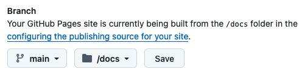

# UBC Library Research Commons: workshop template
{: .no_toc }

<details open markdown="block">
  <summary>
    Table of contents
  </summary>
  {: .text-delta }
1. TOC
{:toc}
</details>

Start with the instructions below to setup a Research Commons workshop repository and website. For more customization and configuration options see [Just the Docs](https://justthedocs.com/) documentation.

## Set up the RC workshop site

*0*{: .circle .circle-green} **Is your work based on a repository that already exists?** For example, an Introduction to R or some other subject? Are you expanding on someone else's work? If so, you don't need a template. You should work on the repository that already exists.

If that's the case:
    * clone the repository.
    * use `git config` to set up your workflow.
    * If you want to to keep a record of the project as it is, create a new branch and give it a name that reflects that work has moved on from that point. For example `nov_2025_archive` or something. If you're really dedicated, you could check out that branch, edit the Readme file to say what it is and commit the change.
    * switch back to the main/master branch, and either work on that or a new branch. Branching is you friend! Do it early and often.

The [Atlassian Git](https://www.atlassian.com/git/tutorials/using-branches) tutorial is much better than the regular Git tutorial. Bookmark it if you haven't already.

{: .highlight}
If this is the case, procede to step *3*{: .circle .circle-green}

 
*1*{: .circle .circle-green} Go to <https://github.com/ubc-library-rc/template> and click the green "Use this template" button. Select "ubc-library-rc" as the owner, add a name, ensure the repository is set to "Public", then click "Create repository from template"


Technically, you don't *have* to make it public. However, you can't have Github Pages website running until your repository _is_ public. But if you want to spend some time with the project completely invisible to the public for a while, you can. Just don't forget to make it public later.
{: .note}
 

*2*{: .circle .circle-green} The web-based portion of your workshop (as opposed to, say, code) lives in the `docs/` directory. This could be most, or even all, of your content, but this structure will allow much easier separation of code and documentation, and is a _de facto_ standard for most real-world projects. In this `docs/` folder of your new repository, the `_config.yml` file contains information about the site and its structure.

This is a sample; your `_config.yml` will probably look very much like this but there may be changes over time. In the case of differences, you should assume that the provided `_config.yml` is preferred over what is displayed here. Comments are preceded by `#`.

```yaml
#Your workshop title, as it appears on the page
#Don't make it too long because it gets truncated
#Quotes optional but sometimes required,
#especially if there's a colon in the title.
title: "Workshop title" 

#Various themes
#remote_theme: ubc-library-rc/rc-theme
remote_theme: ubc-library-rc/rc-theme@dev #specific branch
#remote_theme: ubc-library-rc/rc-theme@5dbd930 #specific commit
##Or Read the Docs
#remote_theme: carlosperate/jekyll-theme-rtd

#This favicon is in the theme, not here, so don't be alarmed
#when you don't see it. 
favicon_ico: assets/images/favicon.svg

#RC colour scheme
color_scheme: rc

#Edit this line to point to the correct location for your workshop
github_repo_url: "https://github.com/ubc-library-rc/REPOSITORY-NAME/"

#The directory which contains all the material.
#ie, the site root directory
#The reveal.js submodule must be here
#source: content

# license information for workshop content
license_name: "Creative Commons Attribution 4.0 International License"
license_url: "http://creativecommons.org/licenses/by/4.0/"
license_image_url: "https://i.creativecommons.org/l/by/4.0/88x31.png"

#Required plugins for the Jekyll remote theme
plugins:
  - jekyll-remote-theme
  - jekyll-seo-tag
  - jekyll-include-cache

# Don't include README or the markdown in reveal.js
exclude:
  - README.md
  - reveal.js/test/simple.md
  - reveal.js/css/theme/README.md
  - reveal.js/examples/markdown.md
  - reveal.js/README.md
```

Replace the following:
- _title_ with your workshop title 
- _github_repo_url_ with your GitHub repository URL (replace only the "REPOSITORY-NAME" part)


{: .note}
A [Creative Commons Attribution 4.0 International License](http://creativecommons.org/licenses/by/4.0/) is applied by default. If you want to change this, update _license_name_, _license_url_ and _license_image_url_ (optional, max 150px wide), and replace the `LICENCE` file. Also note that it's **LICENCE** not **LICENSE** because we are using Canadian English.

*3*{: .circle .circle-green} In the new repository, turn on _GitHub Pages_:
- Go to _Settings_
- Click _Pages_ in the left-hand panel
- Scroll down to the _GitHub Pages_ section
- Under _Branch_, select the branch that you wish to use, which is ordinarily, but not always _main_. Ensure that your pages are being served from the `docs/` directory, then click _Save_.

#### Descriptive screenshot


If you don't see these options under _GitHub Pages_ ensure the repository visibility is _public_ (see the _Change repository visibility_ setting) 
{: .note}

After completing these steps the workshop site should be available at `https://ubc-library-rc.github.io/REPOSITORY-NAME/`. It may take a few minutes for GitHub to generate the site.

*4*{: .circle .circle-green} Update the metadata of your workshop

The files are located at the *root** level of your repository.

| filename | description|
| README.md | The Github landing page/project outline|
| LICEN[CS]E.(md.txt) | License text for the workshop |

Edit the README.md file to have the correct title and link to your workshop. Edit the description so that a \[short\] description can appear on our [workshop landing page](https://ubc-library-rc.github.io/)

{: .note}
Make sure that the description starts with `Description:`. This is is the section that is read in automatically, so having it is important.  


*5*{: .circle .circle-green} Update the web-based content of your workshop 

## Add/edit content pages

The template includes several files that render as pages in the workshop site. These pages are all in the `docs/` directory.

| filename | default page title | description
| --- | --- | ---
| generic_content.md| Generic content | Basic markdown for a page which includes code samples so you don't have to refer back here |
| index.md | Outline | site landing page which contains the introduction and sometimes a schedule |
| land-acknowledgement.md | Land acknowledgement | land acknowledgement with map from <https://native-land.ca>| 
| resources_and_acknowledgements.md | Resources and acknowledgements | for copyright or content notices (default acknowledges the just-the-docs theme) |
| slide_presentation.md| Slide presentation |A template with various presentation styles, both Markdown and HTML, in light and dark themes |

Workshop content pages are written in Markdown with some Just the Docs styling (see [Markdown guide](https://www.markdownguide.org/basic-syntax/) and the [quick guide to styling](text_formatting_options.html)). Create an .md file for each page you would like to add to the site. Include the following YAML header at the start of each .md file.

```yaml
---
layout: default
title: Title of page
nav_order: 1
---
```  
The `nav_order` line establishes where the page will appear in the navigation menu (higher numbers appear lower in the list).

{: .note}
You can name the pages anything you want, with a few caveats but you *must* have an `index.md`. Obviously, you probably want to rename `generic_content.md`. The name of the Markdown page will appear in the URL, so you should make your file names short, distinctive and memorable if you can.  So, `how_to_plot.md` is good, `ef3efb71-6235-49d3-b120-2d6d63cd0413.md` is not as good.

*6*{: .circle .circle-green} Continue to add child pages
Top-level pages on the site (parents) can also have sub-pages (children). Child pages appear in drop-down menus below their parent. The relationship between parent and child pages is defined in the YAML headers of both pages.

Add this to the header of the parent page:

```yaml
has_children: true
```

Add this to the header of the child page:
```yaml
parent: Title of parent page
```
### TOC on parent pages
By default, all pages with children have a Table of Contents that lists the child pages after the parent page’s content. To disable, set `has_toc: false` on the parent page: 
```yaml
has_children: true
has_toc: false
```

### Exclude a page from navigation menu
By default the title of each .md file will appear in the left navigation menu.  To exclude a page add the following to its YAML header
```yaml
nav_exclude: true
```

*7*{: .circle .circle-green} Write your pages in Markdown

Markdown and styling is easy, and you can find a quick guide to formatting the Markdown that the RC uses [here](text_formatting_options.html).


*8*{: .circle .circle-green} Optionally, [add a presentation or two](slides.html) 
